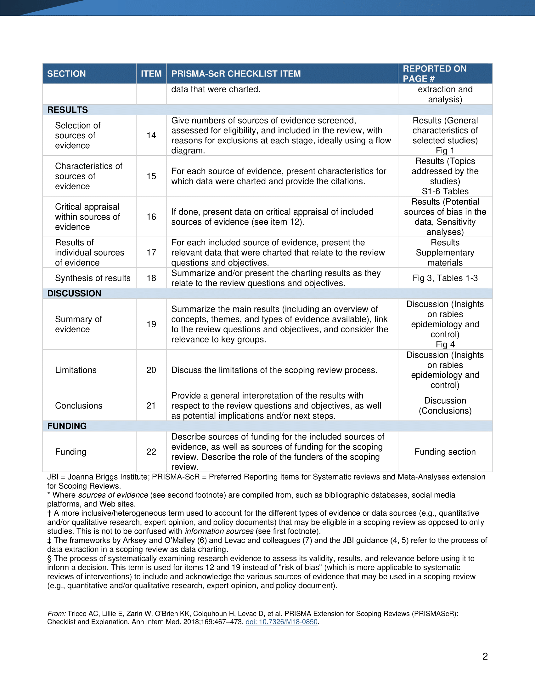

---
title: "Checklist of the PRISMA extension for Scoping Reviews"
output: html_document
--- 

```{r prisma, echo = FALSE, include = TRUE}
knitr::include_graphics("./supplementary/PRISMAScR_checklist_PlosNTD-0.png")

```